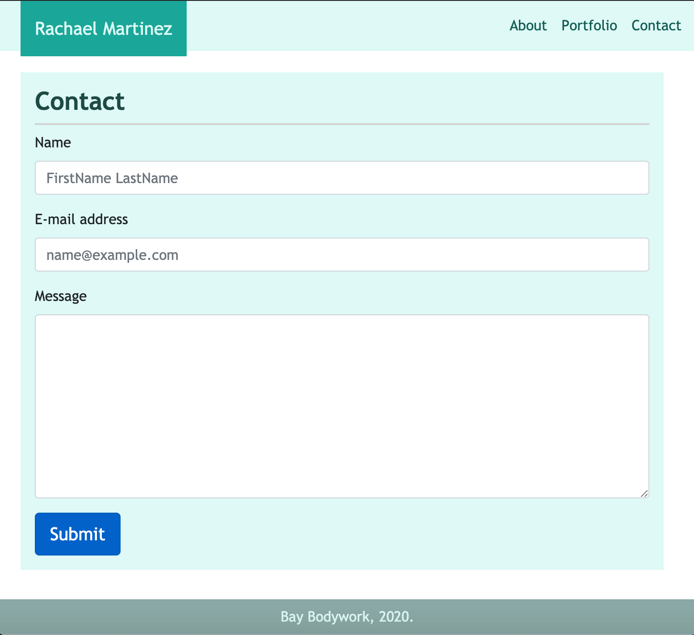
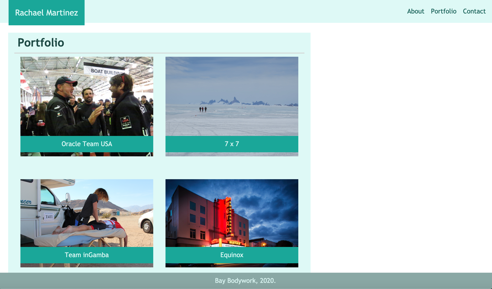

Navigation Bar
1. used nav bar code Bootstrap template for website
1. removed collapsible menu option and search bar
1. adjusted website brand (my name) and navbar to justify to center and fill navbar background color for small screens
1. adjusted website brand to justify left and navbar to justify right for medium and large screens

Welcome page (index.html) and About page (about.html)
1. added appropriate semantic tags
1. organized main content into Bootstrap format container/row/col divs
1. for medium and large screens, main content takes up 8 columns with an invisible placeholder of 4 columns
1. for small screens, picture takes up entire row with text immediately below it; for medium and large screens, picture takes up small portion and text wraps around it

Portfolio
1. for medium and large screens, main content takes up 8 columns with an invisible placeholder of 4 columns
1. for medium and large screens, each portfolio item takes up 6 columns i.e. half of the row; used media query to have pictures adjust in direction proportion to screen size
1. for small screens, each portfolio item takes up entire row

Contact
1. use code templates for forms
1. for large screens, main content takes up 8 columns with an invisible placeholder of 4 columns 
1. for small and medium screens, main content takes up entire row

Footer
1. used Bootstrap attributes to customize footer and keep it at the bottom of the page

